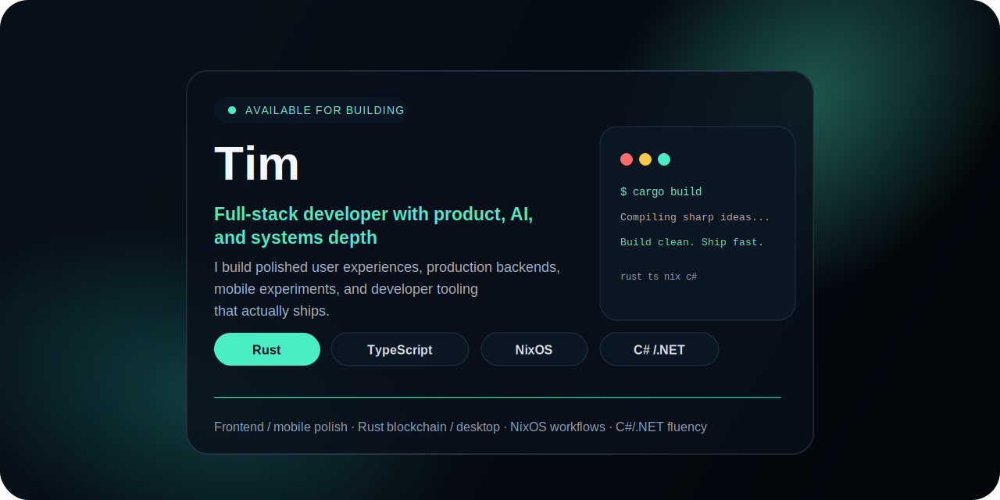
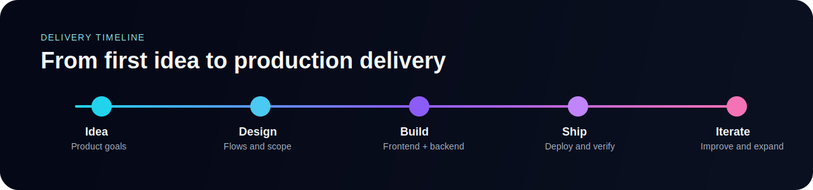

  

<h1 align="center">Tim</h1>

  Full-stack developer from Austria building production-ready software across web, backend, mobile, AI workflows, and developer infrastructure.

  <a href="https://timwitter.com/">Portfolio</a>
  ·
  <a href="mailto:hello@timwitter.com">Email</a>
  ·
  <a href="https://www.linkedin.com/in/timfewi/">LinkedIn</a>

  

## Current Focus

- Shipping polished products with a strong frontend experience and solid backend foundations.
- Building with `Rust`, `TypeScript`, `.NET`, and reproducible `NixOS`-based environments.
- Interested in projects that go beyond plain CRUD: AI tooling, developer platforms, mobile experiences, and modern product engineering.

## Core Stack

  
  
  
  

## Frontend Frameworks

  
  
  
  
  
  

## What I Build

<table>
  <tr>
    <td valign="top" width="50%">
      <strong>Full-Stack Products</strong> 
      From first idea to production rollout: frontend, backend, APIs, databases, and deployment. I work comfortably across React ecosystems, Node.js, C#/.NET, and Rust, with experience in modern architectures, migrations, and long-lived codebases.
    </td>
    <td valign="top" width="50%">
      <strong>Mobile and Web3</strong> 
      Cross-platform apps with React Native and Expo, plus Solana ecosystem work involving wallets, token flows, compressed NFTs, Bubblegum, Helius RPC, and on-chain integrations that move beyond standard app patterns.
    </td>
  </tr>
  <tr>
    <td valign="top" width="50%">
      <strong>AI Integration and Automation</strong> 
      I wire large language models into real systems, build custom API-driven workflows, and use automation to remove repetitive work, shorten feedback loops, and improve product delivery.
    </td>
    <td valign="top" width="50%">
      <strong>DevOps and Delivery</strong> 
      Reproducible environments, Docker-based workflows, GitHub Actions pipelines, NixOS and Nix Flakes, automated releases, and delivery processes that stay maintainable as projects grow.
    </td>
  </tr>
</table>

## How I Build

- Structured, independent, and strongly solution-oriented.
- Comfortable owning work end to end, whether in a solo setup or an agile team.
- Focused on clean architecture, clear communication, and reliable delivery.

## Reach Out

If you are building something ambitious and want someone who can move across product, frontend, backend, and infrastructure without losing quality, let's talk.

- Website: `https://timwitter.com/`
- Email: `hello@timwitter.com`
- Freelancer SaaS: `https://freelancerino.vercel.app/`
- LinkedIn: `https://www.linkedin.com/in/timfewi/`
