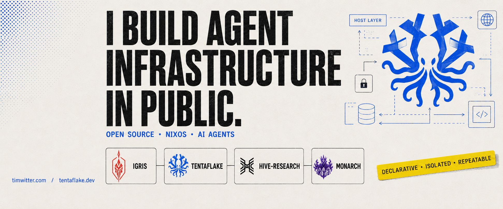

  

  <strong>Software & AI engineer building production-ready products, agent infrastructure, and open-source tools.</strong>
   
  Based in Vienna. Working from product idea to architecture, implementation, deployment, and operation.

## What I build

<table>
  <tr>
    <td valign="top" width="33%">
      <strong>Product Engineering</strong>  
      Software products and internal tools that move from a clear problem to a system people can actually use, deploy, and maintain.
    </td>
    <td valign="top" width="33%">
      <strong>AI Systems</strong>  
      Agent orchestration, retrieval workflows, MCP integrations, and practical automations designed for real operational constraints.
    </td>
    <td valign="top" width="33%">
      <strong>Reproducible Infrastructure</strong>  
      Declarative NixOS environments, isolated runtimes, encrypted secrets, and deployment workflows that remain understandable over time.
    </td>
  </tr>
</table>

## Featured open source

| Project | What it does | Core technologies |
| --- | --- | --- |
| **[Tentaflake](https://github.com/timfewi/tentaflake)** | A NixOS flake for deploying and managing multiple isolated Hermes and ZeroClaw agents on one self-hosted machine. | NixOS, Nix, Docker |
| **[lazy-allrounder](https://github.com/timfewi/lazy-allrounder)** | Cross-platform voice AI for dictation, reading, summarization, explanation, and speech workflows through a GUI and CLI. | Rust, egui, OpenRouter |
| **[git-dashboard](https://github.com/timfewi/git-dashboard)** | A terminal dashboard for monitoring and synchronizing Git repositories across multiple machines. | Rust, ratatui, libgit2 |

## Current focus

- Making self-hosted AI-agent infrastructure easier to deploy, inspect, and operate.
- Building focused cross-platform tools that remove friction from real engineering workflows.
- Connecting product engineering with MCP, retrieval, automation, and reproducible deployment.
- Publishing practical open-source systems instead of isolated demos.

## Core tools

  
  
  
  
  
  
  
  

## How I work

- Start with the business or user problem, not the fashionable tool.
- Treat prototypes as validation steps, not as finished products.
- Design systems for deployment, observability, maintenance, and handover.
- Prefer reproducible and auditable environments over undocumented manual state.
- Reduce complexity instead of hiding it behind another abstraction.

## Work with me

I work with product teams and DACH businesses on software products, internal tools, AI automation, and production-ready agent systems.

  <a href="https://timwitter.com/"><strong>Explore my work</strong></a>
  ·
  <a href="mailto:hello@timwitter.com"><strong>Start a conversation</strong></a>

