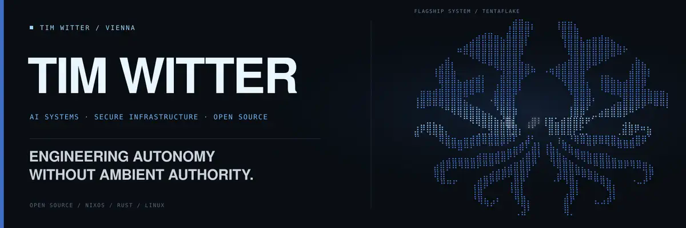

  

  <strong>AI & systems engineer in Vienna.</strong> 
  I build autonomous software with clear boundaries, inspectable behavior, and reproducible infrastructure.

  <a href="https://timwitter.com/">Website</a>
  &nbsp;·&nbsp;
  <a href="https://github.com/timfewi?tab=repositories">Projects</a>
  &nbsp;·&nbsp;
  <a href="mailto:hello@timwitter.com">Contact</a>

## Flagship

### [Tentaflake](https://github.com/timfewi/tentaflake)

**Declarative infrastructure for self-hosted AI agents.**

Tentaflake turns NixOS hosts into constrained agent fleets. Runtimes, storage, network access, secrets, observability, and lifecycle are declared as infrastructure instead of being assembled by hand.

> Autonomy should increase capability, not implicit authority.

`NixOS` &nbsp; `Rust` &nbsp; `isolated runtimes` &nbsp; `brokered egress` &nbsp; `audit trails`

[Repository](https://github.com/timfewi/tentaflake) · [Documentation](https://docs.tentaflake.dev/) · [Website](https://tentaflake.dev/)

## Selected systems

| Project | Purpose | Core |
| --- | --- | --- |
| **[Igris Guardian](https://github.com/timfewi/igris-guardian)** | Capability-bounded prompt-injection firewall for agent systems. | Rust · TypeScript · NixOS |
| **[Memorycreep](https://github.com/timfewi/memorycreep)** | Hardened NixOS workstation for policy-bound AI pentesting and isolated malware analysis. | NixOS · Python · security |
| **[Commitell](https://github.com/timfewi/commitell)** | Turns a dirty Git worktree into one AI-written, DCO-signed commit. | Go · Git · local tooling |
| **[lazy-allrounder](https://github.com/timfewi/lazy-allrounder)** | Cross-platform voice AI for dictation, reading, and speech workflows. | Rust · egui · OpenRouter |

## What connects the work

I work where agent behavior meets the operating system: capability boundaries, reproducible deployment, retrieval, security tooling, and focused products that remain useful without a platform around them.

`declarative over implicit` · `capabilities over ambient authority` · `evidence over claims`

## Open to

Conversations about secure agent infrastructure, unusual systems problems, open-source collaboration, and technically ambitious products.

  <a href="mailto:hello@timwitter.com"><strong>hello@timwitter.com</strong></a>
  &nbsp;·&nbsp;
  Vienna, Austria

