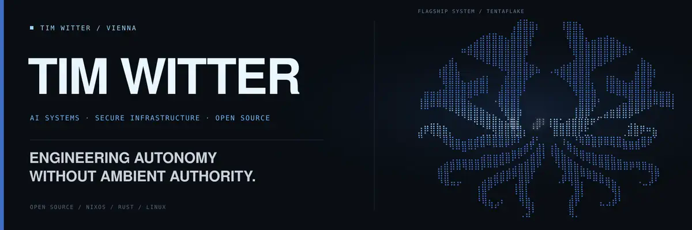

  

<h1 align="center">Tim Witter</h1>

  <strong>Independent software &amp; AI systems engineer in Vienna.</strong> 
  I build the infrastructure that lets AI agents do real work — isolated, declarative and verifiable.

  <a href="https://timwitter.com/">timwitter.com</a>
  &nbsp;·&nbsp;
  <a href="https://timwitter.com/blog/">Writing</a>
  &nbsp;·&nbsp;
  <a href="mailto:hello@timwitter.com">hello@timwitter.com</a>

---

## Open source

### [Tentaflake](https://github.com/timfewi/tentaflake)

**Declaratively deploy and manage multiple isolated AI agents on a single NixOS machine — each with its own secrets, skills, and personality.**

Agents run as OCI containers supervised by systemd. Around them: a Rust operator CLI, an opt-in policy broker for model and fetch egress, a disposable no-egress tool worker, signed-image start gates and encrypted backups — plus an installer ISO to bring up the host.

> Autonomy should increase capability, not implicit authority.

`NixOS` · `Rust` · `OCI containers` · `brokered egress` · `pre-1.0`

[Repository](https://github.com/timfewi/tentaflake) · [Documentation](https://docs.tentaflake.dev/) · [Website](https://tentaflake.dev/)

### [MemoryCreep](https://github.com/timfewi/memorycreep)

**Hardened NixOS workstation for policy-bound, AI-assisted pentesting and isolated malware analysis.**

The host stays minimal — no agent, no pentest tools, no free shell. Work runs inside Cloud Hypervisor MicroVMs, target scope is enforced by host-side nftables after local confirmation, and provider keys reach the VM only through a session-scoped broker. Started as a fork of PentestAgent and has grown into an independent project.

`NixOS` · `Python` · `MicroVMs` · `nftables` · `MCP`

### Agent harness tools

Small, single-purpose building blocks for agent-assisted engineering. Each is local-first, packaged with Nix and usable from any MCP-capable harness or the shell. Together they form a loop: **specify** the contracts, **understand** the code, **verify** the change, **check** the interface.

<table>
<tr>
<td width="50%" valign="top">

**[architecture-kit](https://github.com/timfewi/architecture-kit)**

Specification and verification kit for portable agent systems: transport-neutral tool contracts, runtime profiles, schemas and evidence requirements.

`Python` · `JSON Schema` · `specs`

</td>
<td width="50%" valign="top">

**[ast-index-nix](https://github.com/timfewi/ast-index-nix)**

Local-first AST code index for agent harnesses. Tree-sitter and SQLite behind a single MCP tool for search, outlines, callers and impact — no network, no telemetry.

`Rust` · `tree-sitter` · `MCP`

</td>
</tr>
<tr>
<td width="50%" valign="top">

**[project-check-nix](https://github.com/timfewi/project-check-nix)**

Argv-only verification runner driven by a per-repository manifest. `fast`, `full` and `watch` profiles, no shell evaluation, bounded timeouts.

`Python` · `Nix`

</td>
<td width="50%" valign="top">

**[visual-qa-mcp](https://github.com/timfewi/visual-qa-mcp)**

MCP server for evidence-backed visual QA: inspect a running UI, read findings with screenshots, fix one thing, recheck only what the fix could affect.

`TypeScript` · `Playwright` · `axe-core` · `MCP`

</td>
</tr>
</table>

## About

I'm an independent software engineer based in Vienna, working on web applications, AI integrations and the Linux &amp; NixOS systems underneath them. I like understanding how a system fits together, explaining the trade-offs, and leaving software that stays understandable after handover.

`declarative over implicit` · `capabilities over ambient authority` · `evidence over claims`

`Rust` · `Python` · `TypeScript` · `Go` · `Nix` · `Linux`

## Contact

Working on something similar, or want help with a project? Write to me — a short description and some context are enough.

  <a href="mailto:hello@timwitter.com"><strong>hello@timwitter.com</strong></a>
  &nbsp;·&nbsp;
  <a href="https://timwitter.com/">timwitter.com</a>
  &nbsp;·&nbsp;
  Vienna, Austria

